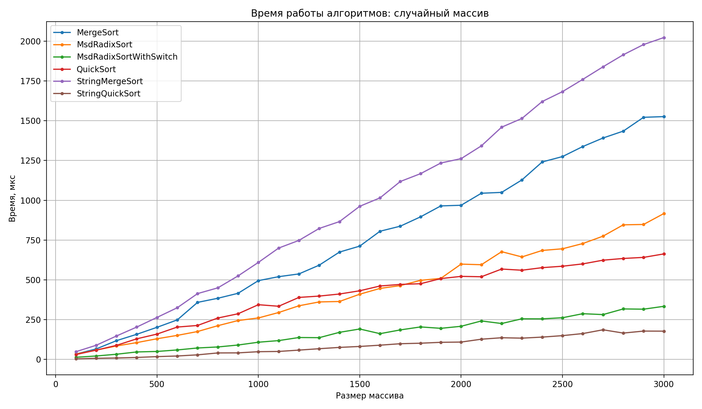
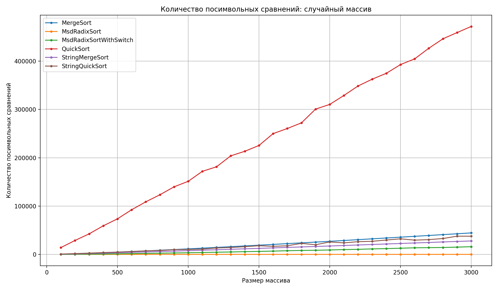
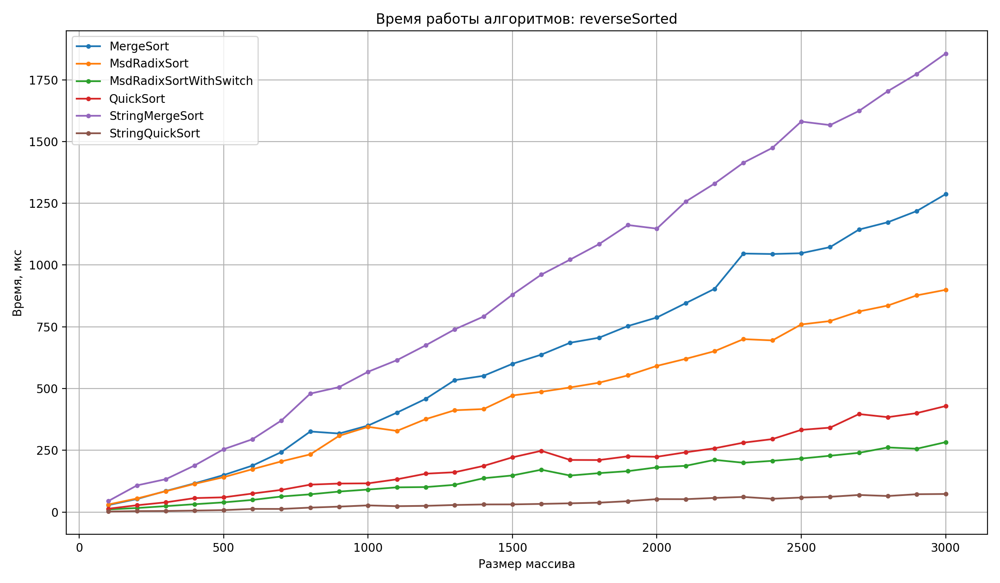
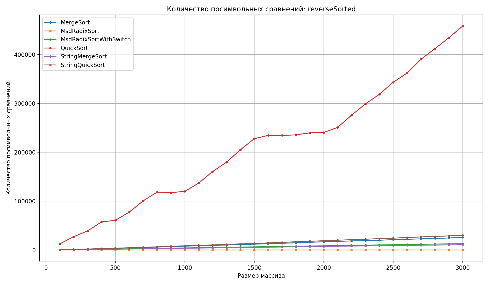
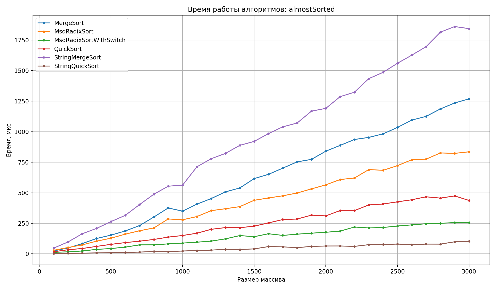
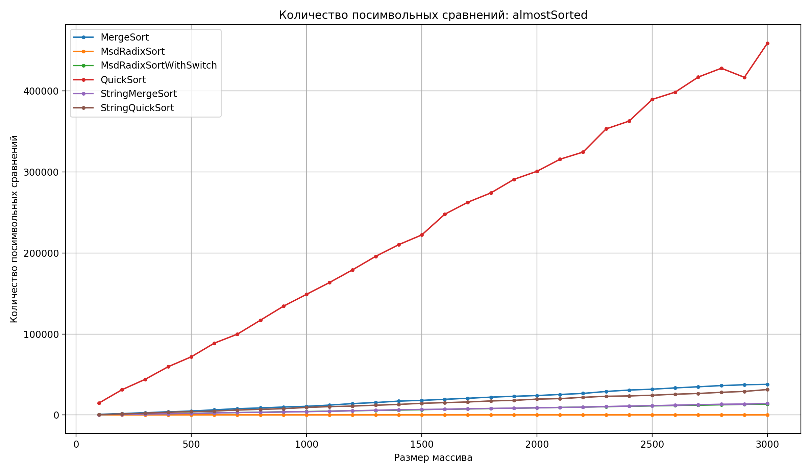
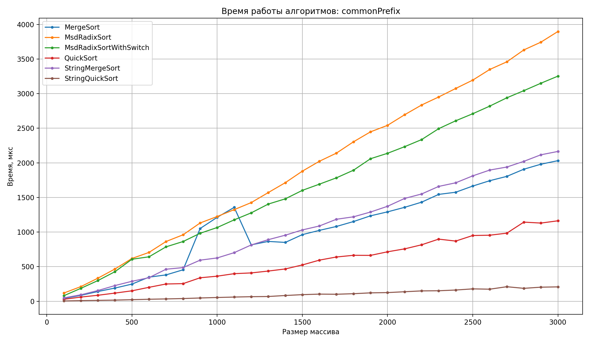
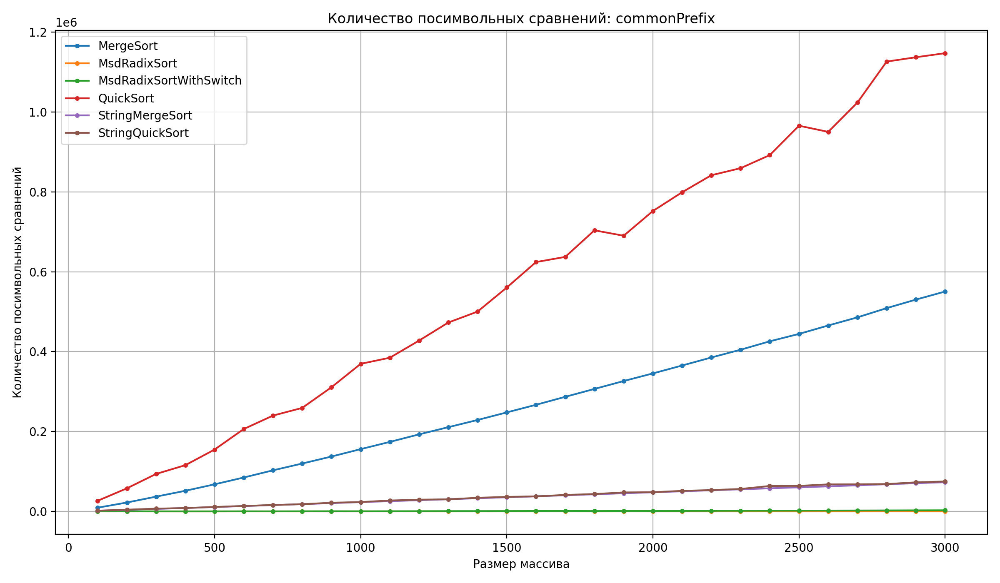

# A1. Анализ алгоритмов сортировки строк

## Codeforces

ID посылок по задачам:

| Задача | ID посылки |
|---|---|
| A1m | `375623334` |
| A1q | `375624044` |
| A1r | `375624519` |
| A1rq | `375624782` |

---


## Реализованные алгоритмы

В работе были реализованы следующие алгоритмы:

| Алгоритм | Описание |
|---|---|
| `QuickSort` | Обыстрая быстрая сортировка строк с обычным лексикографическим сравнением |
| `MergeSort` | Обычная сортировка слиянием строк с обычным лексикографическим сравнением |
| `StringQuickSort` | Тернарный String QuickSort |
| `StringMergeSort` | String MergeSort с использованием LCP |
| `MsdRadixSort` | MSD Radix Sort без переключения на другой алгоритм |
| `MsdRadixSortWithSwitch` | MSD Radix Sort с переключением на String QuickSort при малом размере подмассива |

---

## Генерация тестовых данных

Для генерации строк используется класс `StringGenerator`.

Алфавит содержит 74 символа:

```text
ABCDEFGHIJKLMNOPQRSTUVWXYZabcdefghijklmnopqrstuvwxyz0123456789!@#%:;^&*()-
```

Параметры генерации:

| Параметр | Значение |
|---|---|
| Минимальная длина строки | 10 |
| Максимальная длина строки | 200 |
| Максимальный размер массива | 3000 |
| Шаг размера массива | 100 |

Для каждого типа данных сначала генерируется массив размера 3000, а затем из него берутся подмассивы размера `100, 200, ..., 3000`.

В работе используются 4 типа массивов:

| Тип массива | Описание |
|---|---|
| `random` | Полностью случайный массив строк |
| `reverseSorted` | Массив, отсортированный в обратном лексикографическом порядке |
| `almostSorted` | Почти отсортированный массив, полученный небольшим количеством перестановок в отсортированном массиве |
| `commonPrefix` | Специальный массив строк с общими префиксами |

---

## Измеряемые показатели

Для каждого алгоритма и каждого типа входных данных измерялись:

1. время работы алгоритма в микросекундах;
2. количество посимвольных сравнений.

Для каждого размера массива выполнялось 5 запусков, после чего значения усреднялись при построении графиков.

Формат файла `src/results.csv`:

```csv
algorithm,category,size,trial,time_us,char_comparisons
```

---

## Запуск эксперимента

Скомпилировать программу можно из корня проекта:

```bash
g++ -std=c++17 -O2 src/main.cpp -o string_sorts_test
```

Запуск:

```bash
./string_sorts_test
```

После запуска будет создан файл:

```text
src/results.csv
```

---

## Построение графиков

Для построения графиков используется скрипт:

```text
analysis/plots.py
```

Запуск:

```bash
python3 analysis/plots.py
```

Если библиотеки не установлены:

```bash
pip install pandas matplotlib
```

После запуска графики сохраняются в папку:

```text
docs_results/
```

---

## Результаты эксперимента

Ниже приведены графики времени работы и количества посимвольных сравнений для разных типов входных данных.

### Случайный массив





Для случайного массива быстрее всего оказался `StringQuickSort`. Он работает заметно быстрее обычных `QuickSort` и `MergeSort`.

По количеству посимвольных сравнений обычный `QuickSort` показывает худший результат, потому что при каждом сравнении строк заново просматривает символы с начала.

На размере 3000 были получены следующие средние значения:

| Алгоритм | Среднее время, мкс | Посимвольные сравнения |
|---|---:|---:|
| `StringQuickSort` | 176.80 | 37743 |
| `MsdRadixSortWithSwitch` | 333.00 | 16058 |
| `QuickSort` | 662.60 | 471576 |
| `MsdRadixSort` | 916.40 | 0 |
| `MergeSort` | 1526.20 | 44567 |
| `StringMergeSort` | 2023.40 | 27941 |

---

### Обратно отсортированный массив





На обратно отсортированном массиве `StringQuickSort` также оказался самым быстрым алгоритмом.

Обычный `QuickSort` снова делает больше всего посимвольных сравнений. Это связано с тем, что он использует обычное сравнение строк и не запоминает информацию об уже просмотренных символах.

На размере 3000 были получены следующие средние значения:

| Алгоритм | Среднее время, мкс | Посимвольные сравнения |
|---|---:|---:|
| `StringQuickSort` | 73.00 | 30243 |
| `MsdRadixSortWithSwitch` | 282.80 | 13139 |
| `QuickSort` | 429.00 | 458519 |
| `MsdRadixSort` | 899.60 | 0 |
| `MergeSort` | 1287.00 | 25867 |
| `StringMergeSort` | 1856.40 | 11108 |

---

### Почти отсортированный массив





На почти отсортированном массиве специализированные алгоритмы также показывают преимущество.

Самым быстрым снова оказался `StringQuickSort`. Обычный `QuickSort` работает быстрее, чем `MergeSort`, но делает намного больше посимвольных сравнений.

На размере 3000 были получены следующие средние значения:

| Алгоритм | Среднее время, мкс | Посимвольные сравнения |
|---|---:|---:|
| `StringQuickSort` | 101.60 | 31439 |
| `MsdRadixSortWithSwitch` | 256.60 | 13601 |
| `QuickSort` | 436.80 | 458903 |
| `MsdRadixSort` | 835.20 | 0 |
| `MergeSort` | 1269.00 | 37859 |
| `StringMergeSort` | 1844.00 | 14154 |

---

### Массив с общими префиксами





Массив с общими префиксами особенно хорошо показывает проблему обычных сортировок строк.

Обычные алгоритмы при сравнении строк много раз заново проходят одинаковые начальные символы. Поэтому количество посимвольных сравнений у `QuickSort` и `MergeSort` становится намного больше.

На этом типе данных `StringQuickSort` показывает лучший результат по времени. `StringMergeSort` и `MsdRadixSortWithSwitch` делают меньше сравнений, чем обычные алгоритмы, но из-за особенностей реализации работают медленнее.

На размере 3000 были получены следующие средние значения:

| Алгоритм | Среднее время, мкс | Посимвольные сравнения |
|---|---:|---:|
| `StringQuickSort` | 207.40 | 75253 |
| `QuickSort` | 1162.40 | 1146759 |
| `MergeSort` | 2031.40 | 550476 |
| `StringMergeSort` | 2164.80 | 73375 |
| `MsdRadixSortWithSwitch` | 3253.00 | 3161 |
| `MsdRadixSort` | 3898.20 | 0 |

---

## Сравнение алгоритмов

### Обычные алгоритмы

Обычные `QuickSort` и `MergeSort` используют полное лексикографическое сравнение строк. Из-за этого при большом количестве одинаковых префиксов они многократно сравнивают одни и те же символы.

Поэтому для строк их сложность зависит не только от количества элементов `n`, но и от стоимости сравнения строк.

Если средняя длина строки равна `L`, то грубо можно считать, что обычные алгоритмы могут работать за:

```text
O(L · n log n)
```

На практике это особенно заметно на массиве `commonPrefix`.

### String QuickSort

`StringQuickSort` сравнивает строки не целиком, а по текущему символу. Если символы равны, алгоритм переходит к следующему символу только для соответствующей группы строк.

Из-за этого он избегает большого количества повторных сравнений одинаковых префиксов.

В эксперименте `StringQuickSort` оказался самым быстрым на всех типах входных данных.

### String MergeSort

`StringMergeSort` использует длину наибольшего общего префикса, то есть LCP.

Идея состоит в том, что если для двух строк уже известно, что первые `k` символов совпадают, то при следующем сравнении эти `k` символов можно не проверять заново.

Теоретическая оценка такого алгоритма:

```text
O(Σ LCP(R) + n log n)
```

В эксперименте `StringMergeSort` действительно делает меньше посимвольных сравнений, чем обычные алгоритмы. Однако по времени он оказался медленнее из-за накладных расходов реализации: используются дополнительные структуры `LcpItem`, создаются и копируются векторы.

### MSD Radix Sort

`MsdRadixSort` сортирует строки по символам, начиная со старшего символа. Он не сравнивает символы между собой, а использует текущий символ как индекс корзины.

Поэтому в результатах количество посимвольных сравнений у `MsdRadixSort` равно 0. Это не ошибка измерения: в этом алгоритме есть обращение к символу, но нет сравнения двух символов между собой.

При этом по времени простая реализация `MsdRadixSort` оказалась не всегда быстрой, потому что в ней создаётся много корзин и происходит много копирования строк.

### MSD Radix Sort с переключением

`MsdRadixSortWithSwitch` работает так же, как обычный `MsdRadixSort`, но если размер сортируемого подмассива становится меньше мощности алфавита, алгоритм переключается на `StringQuickSort`.

В эксперименте такая версия оказалась быстрее обычного `MsdRadixSort`, потому что на маленьких подмассивах не создаёт лишние корзины.

---

## Основные выводы

1. Для строк важно учитывать не только количество сравнений элементов, но и количество посимвольных сравнений.

2. Обычные алгоритмы сортировки могут делать слишком много лишней работы, потому что многократно сравнивают одинаковые префиксы строк.

3. `QuickSort` показал худший результат по количеству посимвольных сравнений почти на всех наборах данных.

4. `StringQuickSort` оказался самым быстрым алгоритмом во всех проведённых экспериментах.

5. `StringMergeSort` уменьшает количество посимвольных сравнений, но в текущей реализации проигрывает по времени из-за дополнительных накладных расходов.

6. `MsdRadixSort` не выполняет посимвольных сравнений в привычном смысле, потому что использует символы как индексы корзин.

7. `MsdRadixSortWithSwitch` работает быстрее обычного `MsdRadixSort`, так как на маленьких подмассивах переключается на `StringQuickSort`.

8. На массиве с общими префиксами преимущество специализированных строковых алгоритмов становится особенно заметным.

---
